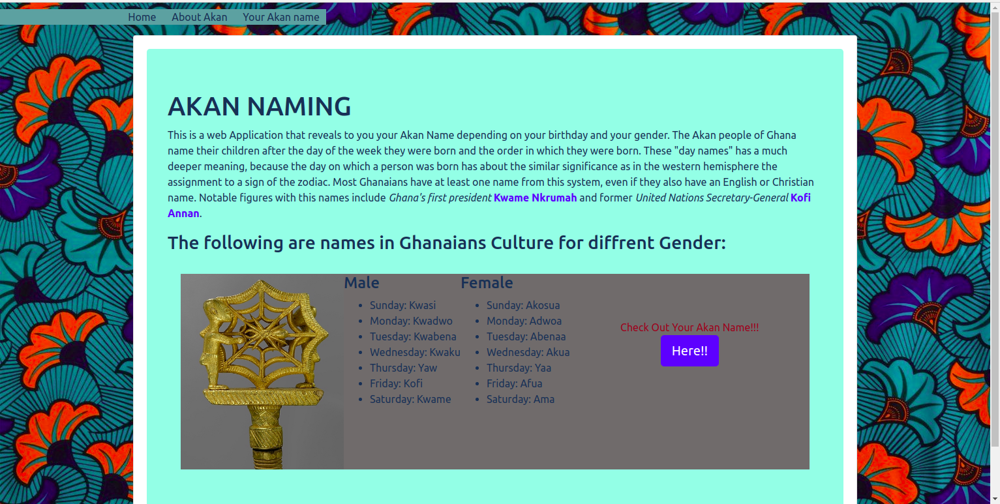
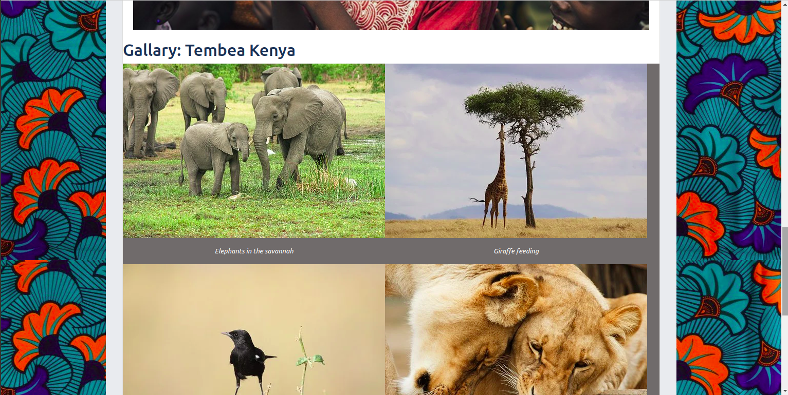
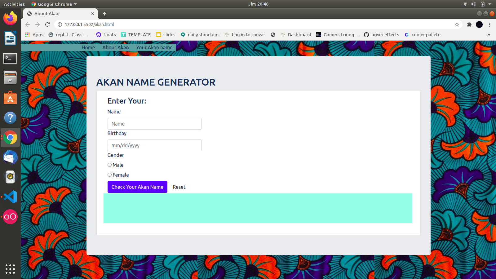

# Akan-Names

A web application that takes a user's birthday and calculates the day of the week they were born and then depending on their gender outputs their Akan Name. Akan names are derived from Ghanian culture. Frequently in Ghana, children are given their first name as a 'day name' which corresponds to the day in the week they were born. 

## Technologies Used
- HTML & CSS (Bootstrap)
- JavaScript 

##### Requirements

JavaScript Console

##### Setup Instructions and Installation

- Clone the repository to a directory in you computer. Link to repo https://github.com/Antony-me/akan-ghana 
- Git init, git clone https://github.com/Antony-me/akan-ghana 
- Open terminal command line then navigate to the directory and open your using your favorite text editor.
- Open `index.html` on your Browser.

## Interactive Input

1. Displays Form For Entering Name, Date and Gender.
   - INPUT: "User Name
   - INPUT: "Users BirthDate in format mm/dd/yyyy"
   - INPUT: "User's Gender Entered"
   - OUTPUT: "Displays User's Name together with his Akan Name"
2. Displays an Error Message if Date Input Left Blank
   - INPUT: ""
   - OUTPUT: "Displays Error Message"
3. Displays an Error Message if Gender Not Chosen
   - INPUT: "" 
   - OUTPUT: "Display an Error Message" 
4. Clears Form and Reset the Message on Click
   - INPUT: "Click Reset Button" 
   - OUTPUT: "Clears and Resets the Form"

## Development

Join me in improving this application.

To fix a bug or enhance an existing module, follow these steps:
- Fork the repo
- Create a new branch (git checkout -b improve-feature)
- Make the appropriate changes in the files
- Add changes to reflect the changes made
- Commit your changes (git commit -am 'Improve feature')
- Push to the branch (git push origin improve-feature)
- Create a Pull Request

##### Link to Live Site : https://antony-me.github.io/akan-ghana/

